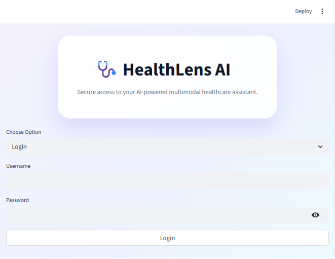
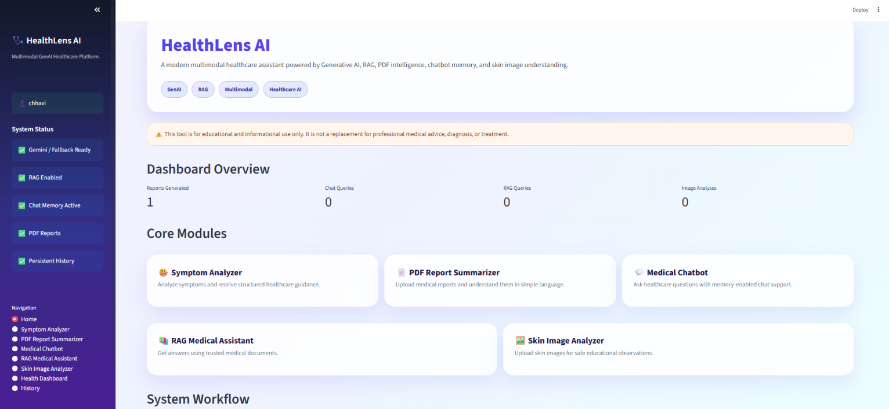
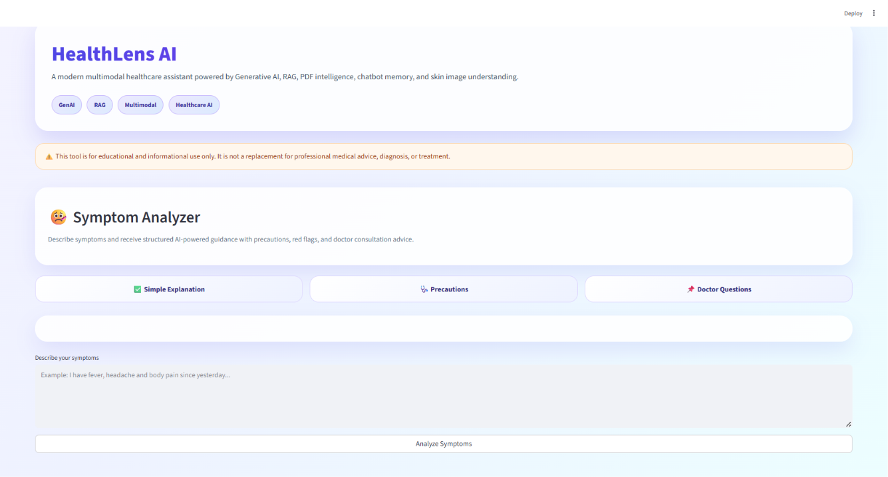
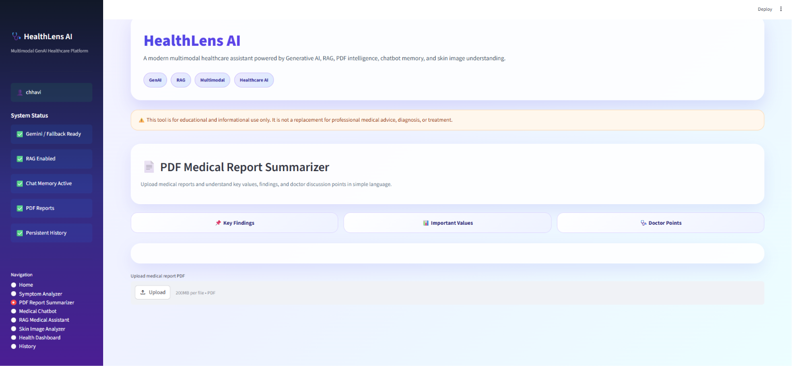
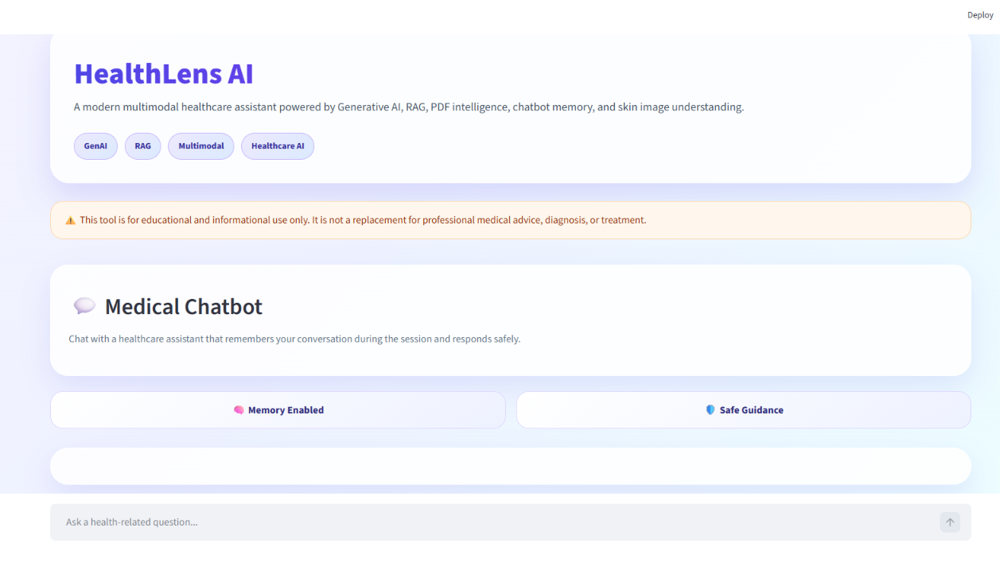
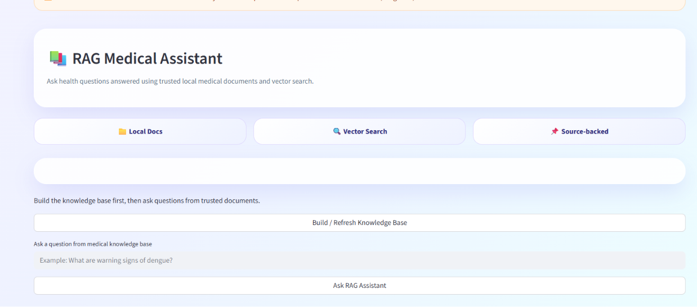
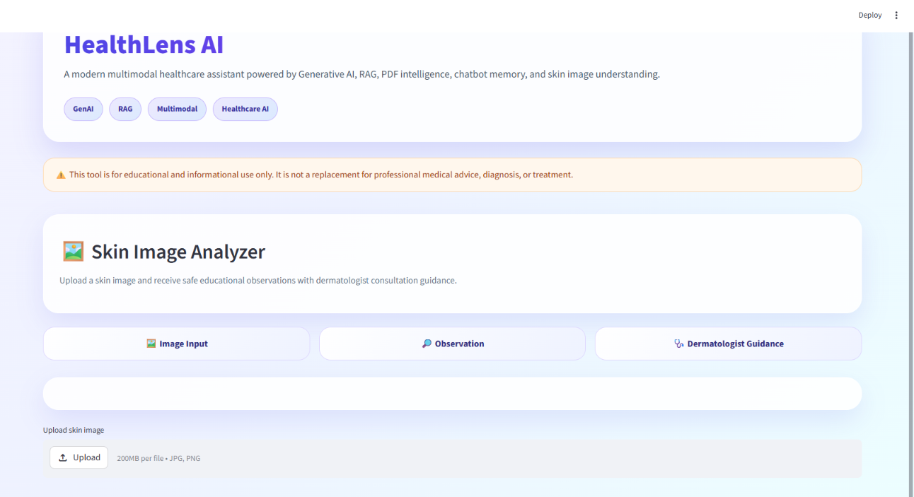
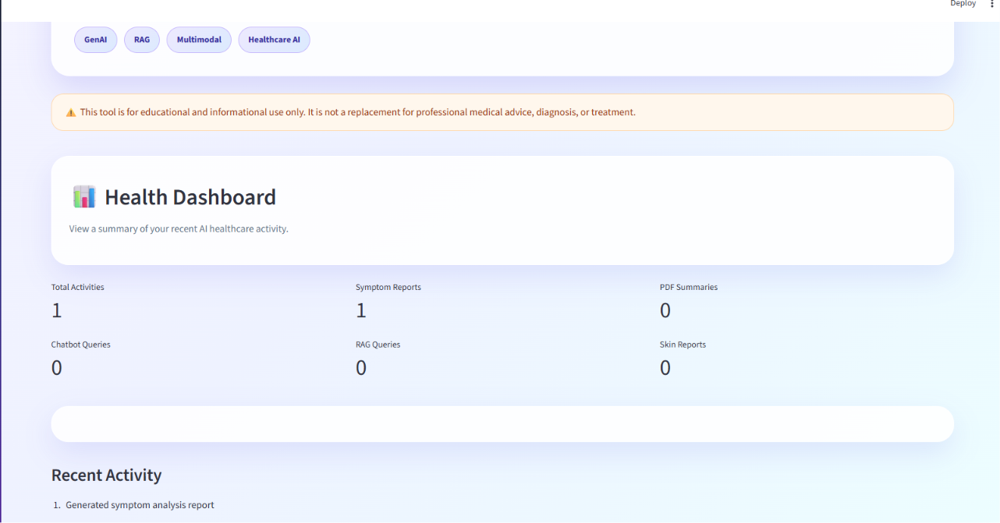

# 🩺 HealthLens AI

A modern multimodal healthcare assistant powered by Generative AI, RAG, chatbot memory, PDF intelligence, and skin image analysis.

## 🚀 Live Demo

Add your Streamlit deployment link here.

---

## ✨ Features

### 🤒 Symptom Analyzer

Analyze symptoms and receive AI-powered healthcare guidance.

### 📄 Medical Report Summarizer

Upload PDF medical reports and get simplified explanations.

### 💬 Medical Chatbot

Ask health-related questions with conversation memory support.

### 📚 RAG Medical Assistant

Get answers using trusted medical documents and vector search.

### 🖼️ Skin Image Analyzer

Upload skin images and receive educational AI observations.

### 📊 Health Dashboard

Track usage statistics and recent healthcare activities.

### 🔐 Authentication

Secure login and signup system for users.

### 🗂️ Persistent History

User activities are stored using SQLite and remain available after login.

### 📄 PDF Report Export

Download professional PDF reports generated by HealthLens AI.

---

## 🛠️ Tech Stack

* Python
* Streamlit
* Google Gemini AI
* LangChain
* FAISS Vector Database
* SQLite
* HuggingFace Embeddings
* FPDF

---

## 📸 Screenshots

### Login Page

### Home Dashboard

### Symptom Analyzer

### PDF Report Summarizer

### Medical Chatbot

### RAG Medical Assistant

### Skin Image Analyzer

### Health Dashboard

---

## 📂 Project Structure

HealthLens-AI/
├── app.py
├── requirements.txt
├── healthlens.db
├── screenshots/
├── data/
├── modules/
│ ├── auth.py
│ ├── analytics.py
│ ├── health_dashboard.py
│ ├── history_db.py
│ ├── memory_chatbot.py
│ ├── pdf_processor.py
│ ├── rag_engine.py
│ ├── report_generator.py
│ ├── safety_checker.py
│ ├── symptom_analyzer.py
│ └── image_predictor.py

---

## ⚠️ Disclaimer

This project is intended for educational and informational purposes only. It is not a replacement for professional medical advice, diagnosis, or treatment.
